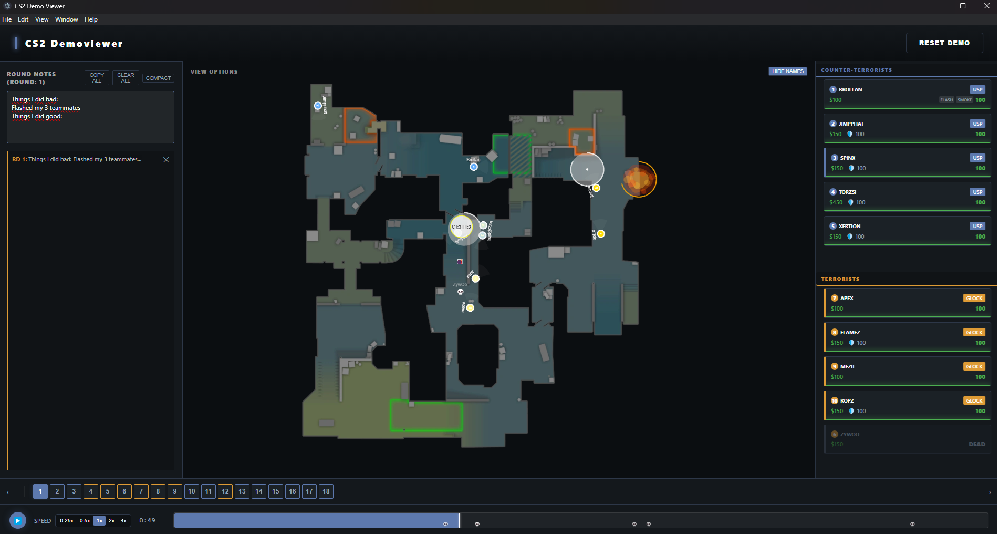

# 🎮 [CS2 2D Demo Viewer](https://yerevin.github.io/cs2-2d-demoviewer/)

[](https://opensource.org/licenses/MIT)
[](https://www.typescriptlang.org/)
[](https://go.dev/)
[](https://webassembly.org/)

A high-performance web application designed for deep analysis and visualization of Counter-Strike 2 (`.dem`) files. Built with a Go parser compiled to WebAssembly and a modern React/PIXI.js frontend.




https://github.com/user-attachments/assets/cfdc6352-dab7-48c6-9e15-86b7a52355e7


## 🚀 Enjoy!

- [Click here to open](https://yerevin.github.io/cs2-2d-demoviewer/)
- Nuke is not supported yet
- Speed of parsing demos is depending on your PC specs

## ✨ Key Features

- **🚀 High-Performance Parsing**: Custom Go-based parser powered by `demoinfocs-golang/v5` for lightning-fast demo processing.
- **📍 Interactive 2D Radar**: Smooth, WebGL-accelerated map visualization using **PIXI.js**.
- **📊 Professional Player Cards**: Real-time HP visualization, equipment tracking, and performance stats.
- **💣 Utility Visualization**:
  - **Smokes & Molotovs**: Animated coverage areas with duration timers.
  - **Flashes**: Burst effects with counters showing exactly how many players were blinded (e.g., `CT:1 | T:2`).
  - **Trajectories**: Persistent, smoothed paths for all thrown projectiles.
- **🔄 Intelligent Match Logic**:
  - Automatically filters knife rounds and warmups.
  - **Freeze-Time Skipping**: Jump directly to the action at the start of every round.
- **🗺️ Multi-Map Support**: Optimized configurations for all active duty maps (_Dust2, Mirage, Inferno, Ancient, Anubis, Overpass_).
- **🌗 Esports Aesthetic**: A dark, high-contrast UI designed for professional analysis.
- **🧩 Faceit Chrome Extension Bridge**: Optional extension injects a **View 2D Demo** button next to **Watch demo** and opens the viewer with archive URL auto-loading.
- **📦 Archive Ingestion**: Viewer can download and parse `.zip`, `.gz`, or raw `.dem` input from URL (including extension-proxied downloads when direct CORS fetch is blocked).

## 🛠️ Tech Stack

- **Frontend**: React (TypeScript), PIXI.js (2D Engine), TailwindCSS.
- **Parser Core**: Go (`main.go`) compiled to WebAssembly.
- **Build System**: Webpack.

## 🚀 Getting Started for development

### Prerequisites

- **Node.js**: v20.0 or higher
- **Go**: v1.24 or higher (required for building the WASM parser)
- **Git**

### Installation

1. **Clone the repository**:

   ```bash
   git clone https://github.com/yerevin/cs2-2d-demoviewer.git
   cd cs2-2d-demoviewer
   ```

2. **Install Node dependencies**:

   ```bash
   npm install
   ```

3. **Build the Go WASM Parser**:
   The application requires the Go WebAssembly binary to process `.dem` files in the browser.
   ```bash
   # Build the wasm module into public/parser
   go mod tidy
   npm run parser:wasm
   ```

### Running in Development

```bash
npm run dev
```

This starts the Webpack dev server with hot-reloading enabled.

## 🧩 Faceit Extension (optional)

This repo includes an unpacked Chrome extension in:

- `extensions/faceit-demo-bridge`

### What it does

1. Detects `Watch demo` in Faceit match rooms.
2. Adds `View 2D Demo` next to it.
3. Resolves final archive URL and opens viewer as:
   - `...?demoArchiveUrl=<encoded-url>`
4. Viewer downloads archive, extracts `.dem`, and parses automatically.
5. If direct browser fetch is blocked by CORS, viewer falls back to extension bridge proxy download.

### Install extension

1. Open `chrome://extensions`
2. Enable **Developer mode**
3. Click **Load unpacked**
4. Select `extensions/faceit-demo-bridge`

### Optional local viewer override

The extension defaults to GitHub Pages viewer URL. To route button clicks to local dev viewer:

```js
chrome.storage.sync.set({ viewerUrl: "http://localhost:3000/" });
```

### Security model

- Extension only accepts `http/https` URLs.
- Cross-origin download is performed by extension background service worker using explicit host permissions.
- Downloaded archive bytes are cached in-memory temporarily and cleaned after transfer/TTL.

## 📦 Building for Production

### Build Assets

```bash
npm run build
```

### Build static site for GitHub Pages

```bash
npm run build
```

Static files (including the parser `.wasm`) will be generated in the `dist/` directory.

## 🏗️ Architecture

1.  **Go Parser (WASM)**: Parses `.dem` bytes in-browser and returns frame-by-frame JSON.
2.  **Renderer (React)**: Loads the WASM module and drives the PIXI.js game loop to visualize the match.

## 🗺️ Map Configuration

Maps are defined in `assets/maps/<map_name>/config.json`. Each config includes:

- `pos_x`, `pos_y`: World coordinate offsets.
- `scale`: Coordinate-to-pixel scaling factor.
- `levels`: Support for multi-level maps (like Nuke) with Z-axis thresholding.

## 🤝 Contributing

Contributions are welcome! Please feel free to submit a Pull Request.
This project was vibe coded and 98% of the code was written by AI, so I am not responsible for the code quality.

1. Fork the Project
2. Create your Feature Branch (`git checkout -b feature/AmazingFeature`)
3. Commit your Changes (`git commit -m 'Add some AmazingFeature'`)
4. Push to the Branch (`git push origin feature/AmazingFeature`)
5. Open a Pull Request

## 📄 License

Distributed under the MIT License. See `LICENSE` for more information.

---

**Note**: _This project is not affiliated with, authorized, or endorsed by Valve Corporation. Counter-Strike 2 is a trademark of Valve Corporation._
